# Exercise 2 - Collections Upload to Automation Hub?

## Table of Contents

- [Objective](#objective)
- [Red Hat Automation Hub](#red-hat-automation-hub)
    - [Certified Content](#certified-content)
    - [Supported Automation](#supported-automation)
- [Ansible Galaxy](#ansible-galaxy)
- [How to use Automation Hub](#how-to-use-automation-hub)
    - [Accessing collections](#accessing-collections)
       - [Creating a token](#creating-a-token)
       - [Using authentication token](#using-authentication-token)
       - [Using Collections](#using-collections)
    - [Authenticate Tower to Automation Hub](#authenticate-tower-to-automation-hub)
- [Takeaways](#takeaways)

# Objective

In this lab you will learn the value proposition of Private Red Hat Automation Hub and how to use the provided content.

# Red Hat Automation Hub

The Private Ansible Automation Hub, is a seperate instance that allows you to upload collections, these can be the certified Ansible Content Collections by Red Hat and its Partners. Community collections from Galaxy as well as the custom collections you build.
These content collections contain ways to consume automation, how-to-guides to implement them in your infrastructure. The support for Automation Hub is included with Red Hat Automation Platform subscription.

# Certified Content

Certified collections are developed, tested, built, delivered, and supported by Red Hat and its Partners. To find more details about the scope of support, check the [Ansible Certified Content FAQ](https://access.redhat.com/articles/4916901),

## Supported Automation

Certified Ansible collections are backed by support from Red Hat to deliver additional reassurance for customers. Additional supportability claims for these collections may be provided under the "Maintained and Supported By" one of Red Hat Partners.

# Ansible Galaxy

It is the location for wider Ansible community that initially started to provide pre-packaged units of work known as Ansible roles. Roles can be dropped into Ansible Playbooks and immediately put to work. in a recent version of Galaxy started to provide Ansible content collections as well.

Ansible Galaxy resides on [https://galaxy.ansible.com/](https://galaxy.ansible.com/)

# How to use Automation Hub

## Accessing collections

Ansible collections can be used and downloaded from multiple locations. They can either be downloaded using a requirement file, statically included in the git repository or eventually installed separately in the virtual environment.

In the scope of this exercise, the focus is how to use the Private Automation Hub, how to upload collection and how to access content from Automation Hub.

## Creating users in Automation Hub

Authentication for Private Automation hub can be configured to use a backend environment like Active Directory but for this workshop we will be using local users.

1.) log into your Private Automation Hub the details are on your workshop main page.

   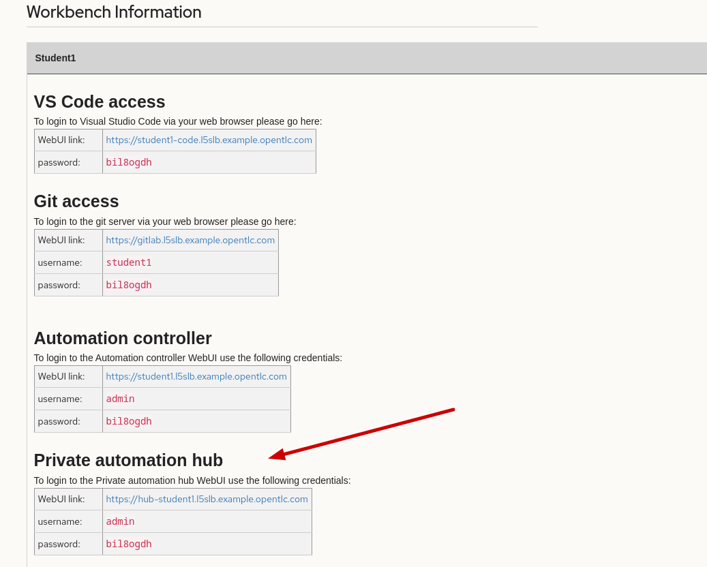

Username is admin and password as found on your workbench page
   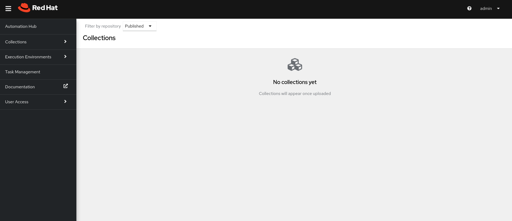

After Logging in you will see a screen showing its empty of collections.
   

We want to go ahead and create a group

Expand User Access and select Groups.
   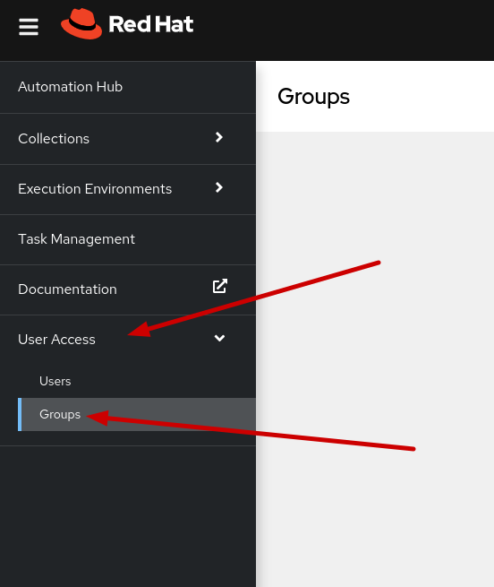

Select Create Group
   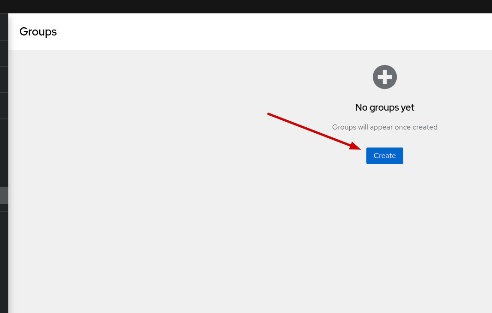

Create the group called devops
   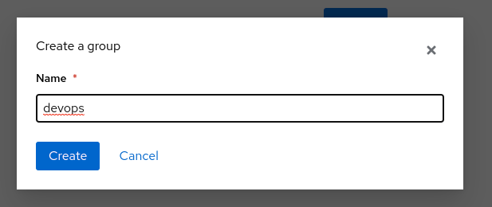

The group has no roles asociated yet so we want to add roles.
   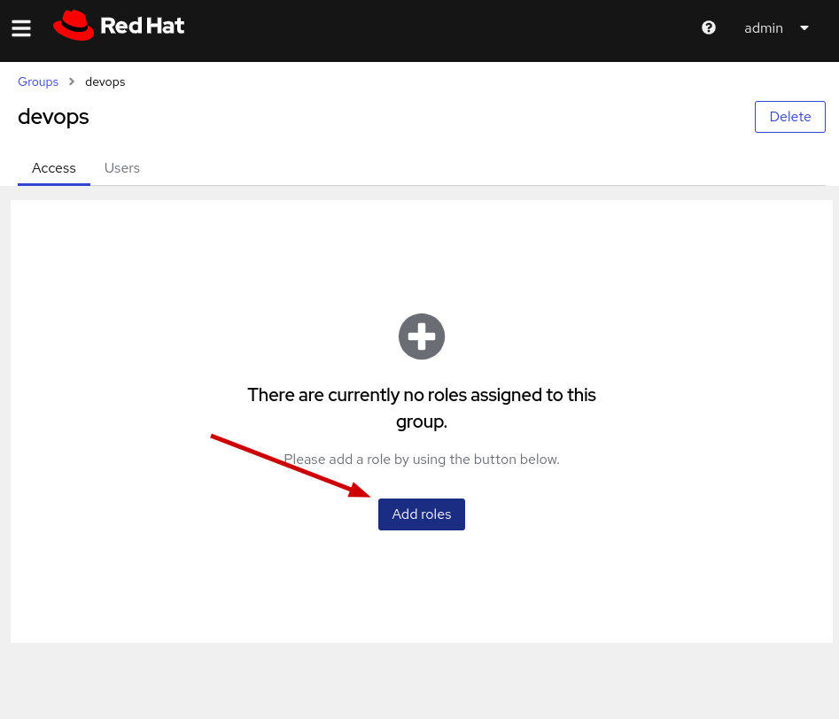

We want to give it the ability to upload to namespaces, select galaxy.collection_publisher. you are free to add aditional if you want to also, and click next.
   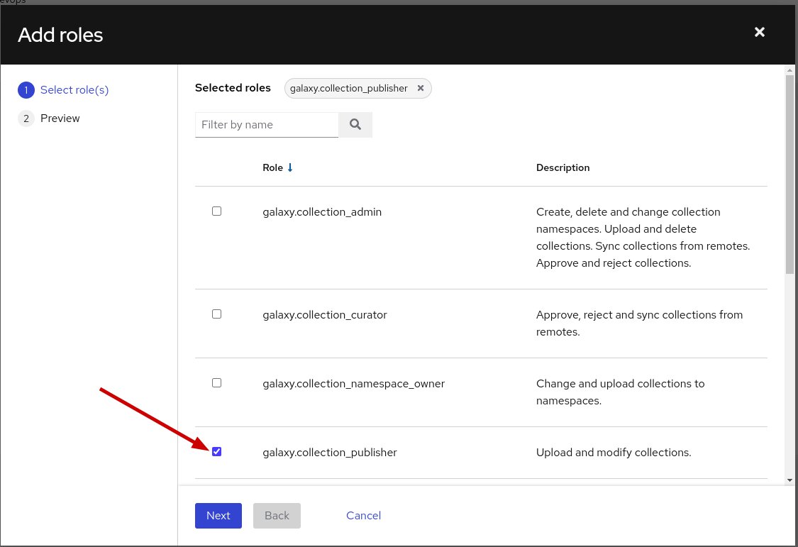

Review and click Add
   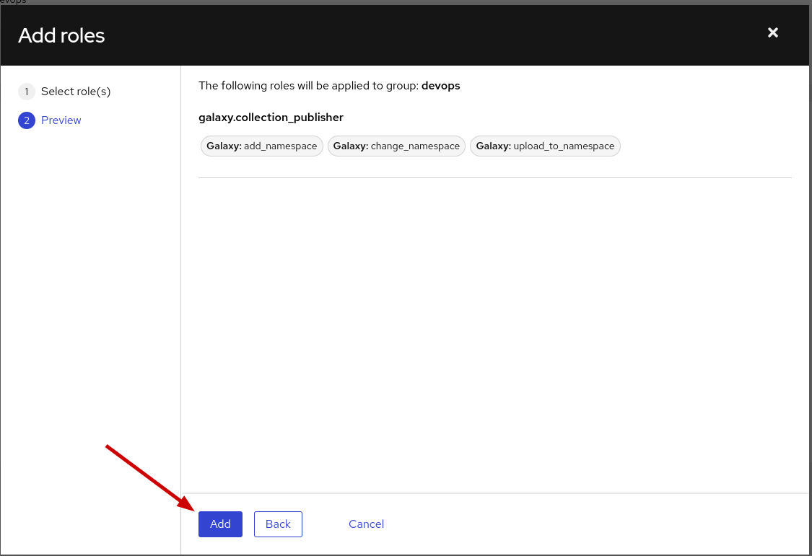
   
Next we then want to create a user so click on Users under User Access and then click on create
   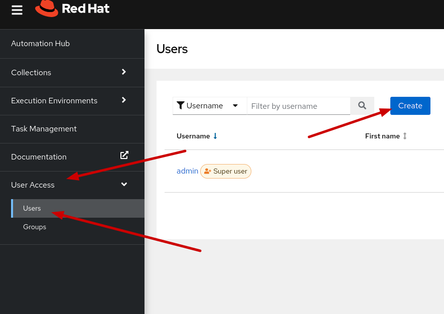

Call the username devuser, You can use any password thats 8 charecters long Welcome1! works and add it to the devops group and click save.
   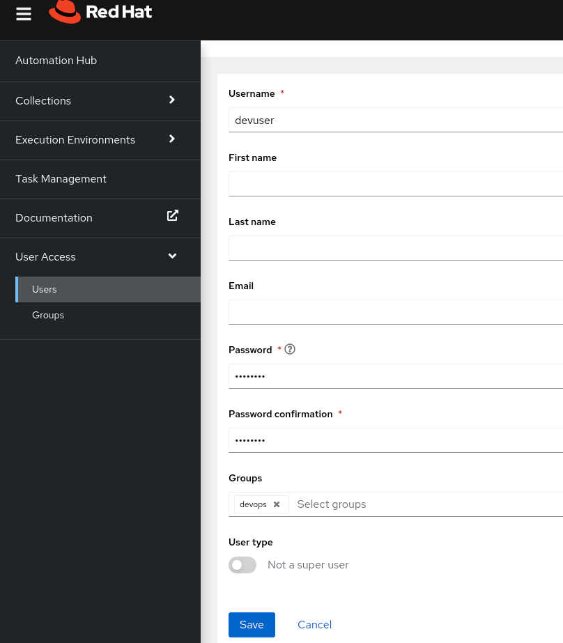

We want to create a namespace that is the same as the collection we built earlier 'workshop'

Expand Collections and select Namespaces
   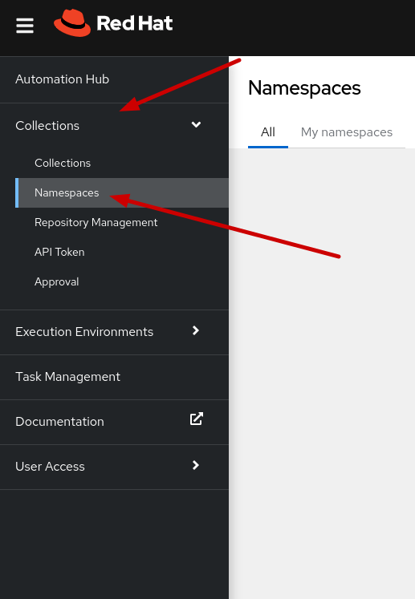

Select Create Namespaces
   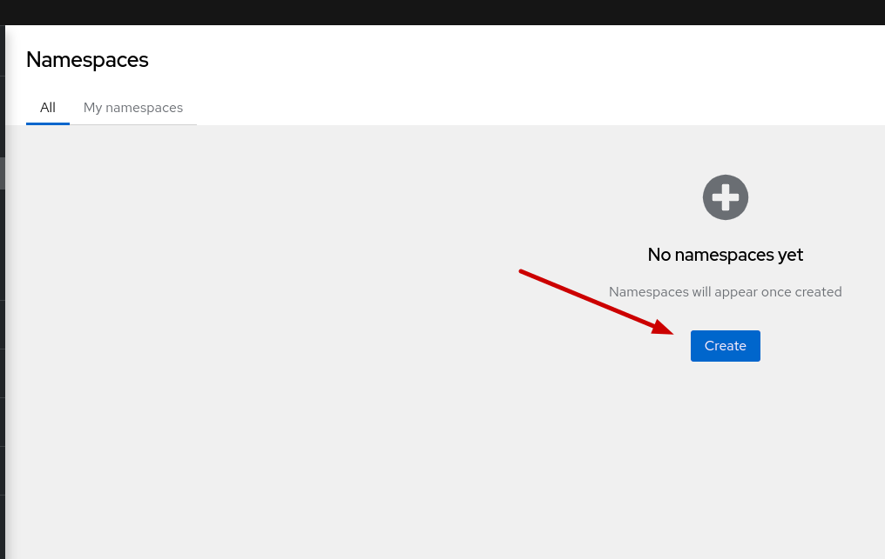

Give it the name workshop ( lowercase ) select the devops group from the list, note the permissions we set on the group are global, however we can add or remove permissions to be specific to the namespace if needed, and click create.
   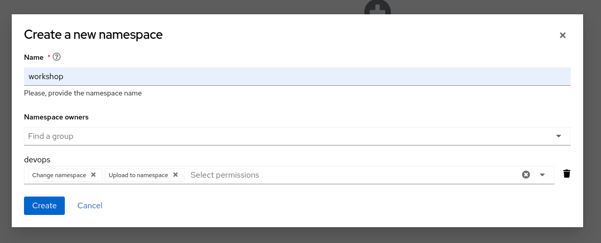

Now we are in the workshop namespace on Automation Hub, we could upload the collection directly here with the tar ball file we created earlier but we will be uploading from the cli instead.

We will need to populate the url and the token from Automation hub which into our command line which we can find as follows.


In the namespace select the CLI Configuration and copy the url.
   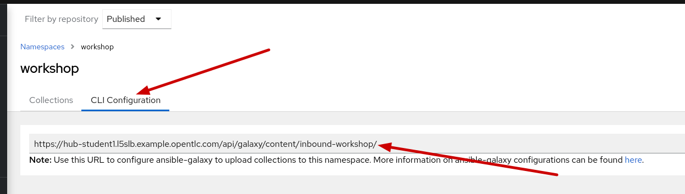

For the token

Go to API Token under Collections and click Load token.
   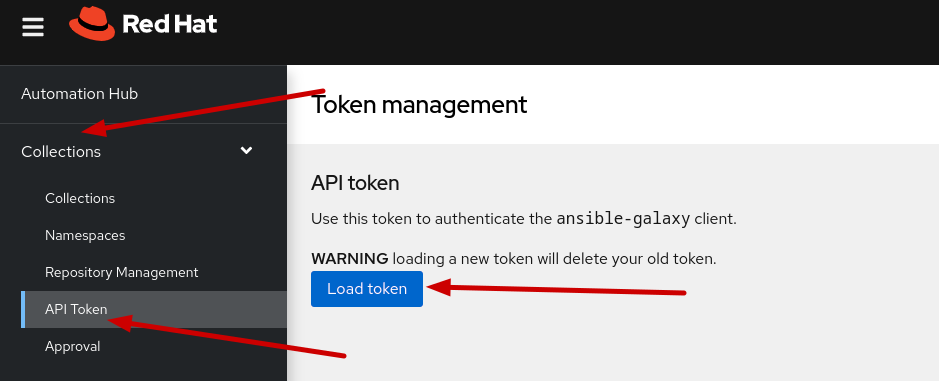

Copy the token
   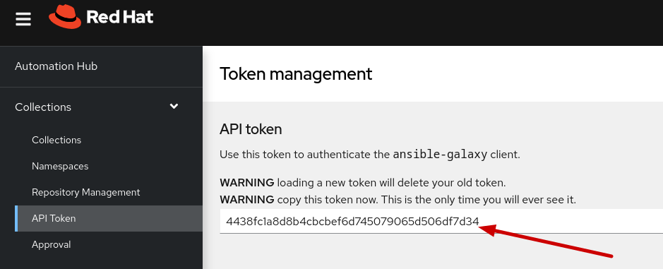

Navigate to the directory of the tar ball
```
cd ~/workspace/ansible_collections/workshop/demo_collection
```
Run the following to upload to Automation Hub

```
ansible-galaxy collection publish -s 'URL' --token 'APIKEY' -c workshop-demo_collection-1.0.0.tar.gz
```

Back in Automation Hub, click on Collections, Namespaces and view collections. 
   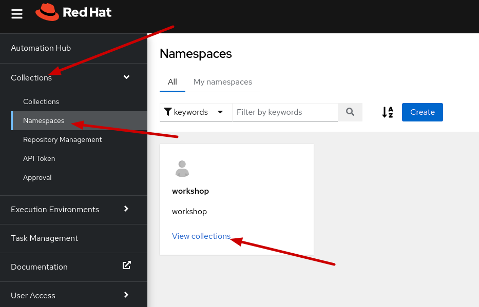

You will see that it is empty, because we have not approved the collection yet, by default all new collections and updated versions need to be approved before you can use the.

Click on Approval under Collections and select approve.
   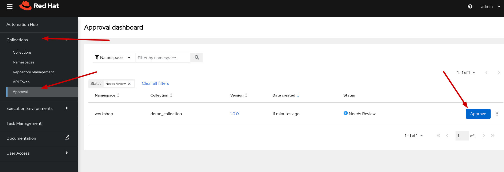

You will now see your collection is available and has the version information as well as Documantion and contents available.


----
**Navigation**
<br>
[Previous Exercise](../1-create-collections/) - [Next Exercise](../3-collections-from-playbook/)

[Click here to return to the Ansible for Red Hat Enterprise Linux Workshop](../README.md)
