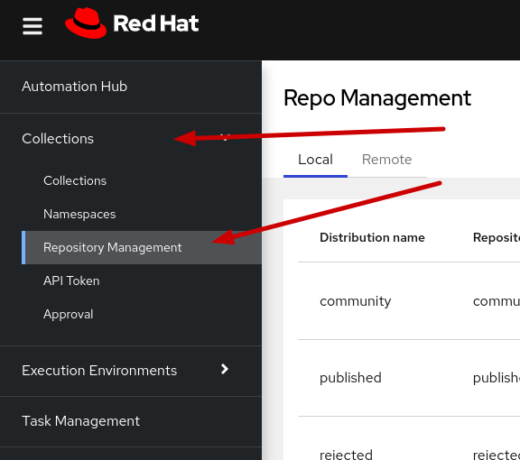
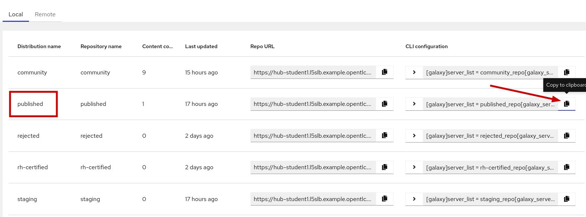

# Exercise 3 - Using Ansible Collections

## Table of Contents

- [Objective](#objective)
- [Guide](#guide)
    - [Step 1 - Install the Ansible Collection](#step-1---install-the-ansible-collection)
    - [Step 2 - Write an Ansible Playbook](#step-2---write-an-ansible-playbook)
    - [Step 3 - Test the playbook](#step-3---test-the-playbook)
    - [Step 4 - Simplify the namespace](#step-4---simplify-the-namespace)
    - [Step 5: Test the change](#step-5-test-the-change)

# Objective

In this part of the lab, you will learn how to use an Ansible Collection in your playbook. To identify a specific module from an Ansible Collection, we have to use the fully qualified collection name. This name is built from the name of the author, the name of the collection and the name of the module.

    <author>.<collection>.<module>

For the following exercise, we will use a collection written by the Ansible Core Team. The name of the author is therefore "ansible". You can find a list of all modules and collections written by the Ansible Core Team on [Ansible Galaxy](https://galaxy.ansible.com/ansible).

As you can see they maintain several collections and roles. One of their collections is called "posix" and we can find the documentation and additional details on the [Ansible Galaxy POSIX Collection](https://galaxy.ansible.com/ansible/posix) page.

One of the modules provided by this collection allows us to manage [SELinux](https://www.redhat.com/en/topics/linux/what-is-selinux) settings. The fully qualified collection name for this module is therefore `ansible.posix.selinux`.

You can find more details about [using collections](https://docs.ansible.com/ansible/latest/user_guide/collections_using.html) in the [Ansible Documentation](https://docs.ansible.com/).

# Guide

## Setting up Ansible to pull from Automation Hub.

By default Ansible will pull collections from galaxy.anisble.com ( The community based offering ) so we need to configure ansible to be able to pull from the Private Automation Hub, 

# Automtion Hub Galaxy repo.
Navigate to Collections, Repository Management
   

We want the Published repo and Automation Hub will give us the complete configuration we need to create out config file.
Click on the copy icon next to the CLI configuration we need.
   

We want to create a .ansible.cfg file in our home directory and populate it with what we just copied from Automation hub.

```
[galaxy]
server_list = published_repo

[galaxy_server.published_repo]
url=https://hub-student1.l5slb.example.opentlc.com/api/galaxy/content/published/
token=<put your token here>
```

Add in the token we had from earlier or if needed regenerate the token.

Also add at the top after server_list the following line ignore_certs = yes
so it will look like this

```
[galaxy]
server_list = published_repo
ignore_certs = yes

[galaxy_server.published_repo]
url=https://hub-student1.l5slb.example.opentlc.com/api/galaxy/content/published/
token=<put your token here>
```

The configuration file will only allow our user to pull from the single repo of published but we may still want to access Galaxy or other repos, for now we will add in Galaxy as a second repo and set the order to pull from.

```

[galaxy]
server_list = published_repo, release_galaxy
ignore_certs = yes

[galaxy_server.published_repo]
url=https://hub-student1.l5slb.example.opentlc.com/api/galaxy/content/published/
token=<put your token here>

[galaxy_server.release_galaxy]
url=https://galaxy.ansible.com/

```
The server list sets the order with a comma seperated list for us and does not require a token for the community based one.

## Step 1 - Install the Ansible Collection

The `ansible.posix.selinux` module which we want to use for this exercise, it part of the `ansible.posix` collection. We have to install this collection first, before we can use its modules. The `ansible-galaxy` command line tool can be used to automate the installation. It us preconfigured to search for roles and collections on [Ansible Galaxy](https://galaxy.ansible.com/) so we can just specify the collection name and it will take care of the rest:

    ansible-galaxy collection install ansible.posix --ignore-certs

This will install collection on your system, only if it wasn't installed before. To force the installation, for example to make sure you're on the latest version, you can add the force switch `-f`.

    ansible-galaxy collection install -f ansible.posix --ignore-certs

We want to also ensure we can pull our collection from private automation hub as we had this installed before we will force the installation.

    ansible-galaxy collection install -f workshop.demo_collection --ignore-certs

This will always download and install the latest version, even if it was already up to date. Ansible Collections can have dependencies for other Ansible Collections as well - if you want to make sure those dependencies are refreshed as well, you can use the `--force-with-deps` switch.

By default the installation is stored in your local `~/.ansible` directory. This can be overwritten by using the `-p /path/to/collection` switch. Keep in mind though that `ansible-playbook` will only use that directory if you change your `ansible.cfg` accordingly.


## Step 2 - Documentation

The `ansible-doc` command only searches the system directories for documentation. You can still use it though to read up on modules you installed from Ansible Collections by using the fully qualified collection name.

Let's have a look at the module documentation for the `selinux` module which we are going to use in the next part of the exercise:

```bash
ansible-doc ansible.posix.selinux
```

> **NOTE**: Depending on your screen resolution you might have to press `q` to leave the documentation viewer.

## Step 3 - Write an Ansible Playbook

We want to use the SELinux module to make sure it is configured in enforcing mode. SELinux is a kernel feature which brings extra security to our Linux system and it is highly recommended to always keep it enabled and in enforcing mode. If you're new to SELinux, there is a nice article on [What is SELinux](https://www.redhat.com/en/topics/linux/what-is-selinux) to get you started.

Let's write a simple playbook which enables SELinux and sets it to enforcing mode on the local machine, as well as runs a module from our custom collection.

```yaml
cat > ~/workspace/ansible_collections/demo_playbook.yml << EOF
---
- name: Run demo collection module
  hosts: localhost
  become: yes
  vars: 
    friend_name: John Doe
  tasks:
  - name: Generate greeting and store result
    workshop.demo_collection.demo_hello:
      name: "{{ friend_name }}"
    register: demo_greeting

  - name: Show value from demo_hello
    ansible.builtin.debug:
      var: demo_greeting
EOF
```


> **NOTE**: Pay special attention to the module name. Typically you would see something like `selinux`, but since we are using a module provided by an Ansible Collection, we have to specify the fully qualified module name.

## Step 4 - Test the playbook

You can run the Playbook and see what happens:

    ansible-playbook demo_playbook.yml

## Step 5 - Simplify the namespace

If you use many modules from Ansible Collections in your Playbook, the <author>.<collection> prefix can become quite annoying it reading your Playbook can become harder as well.

You can use the `collections` key word to skip defining the namespace with every task.

```yaml
---
- name: set SELinux to enforcing
  hosts: localhost
  become: yes
  collections:
  - workshop.demo-collection
  - ansible.builtin
  tasks:
  - name: Generate greeting and store result
    demo_hello:
      name: "{{ friend_name }}"
    register: demo_greeting

  - name: Show value from demo_hello
    debug:
      var: demo_greting
```

> **NOTE**: Although the syntax looks similar to how you specify roles, this works different. They keyword `roles` will execute the `tasks/main.yml` in each role. The `collections` keyword is merely a shortcut so you can skip the author and namespace every time you use a module in a task.

## Step 6: Test the change

When running the Playbook again, you shouldn't actually see any difference in the output. As explained before, the `collections` keyword only simplifies writing your Playbook.

----
**Navigation**
<br>
[Previous Exercise](../2-collections-upload-to-Automation-Hub/) - [Next Exercise](../4-collections-from-roles/)

[Click here to return to the Ansible for Red Hat Enterprise Linux Workshop](../README.md)
