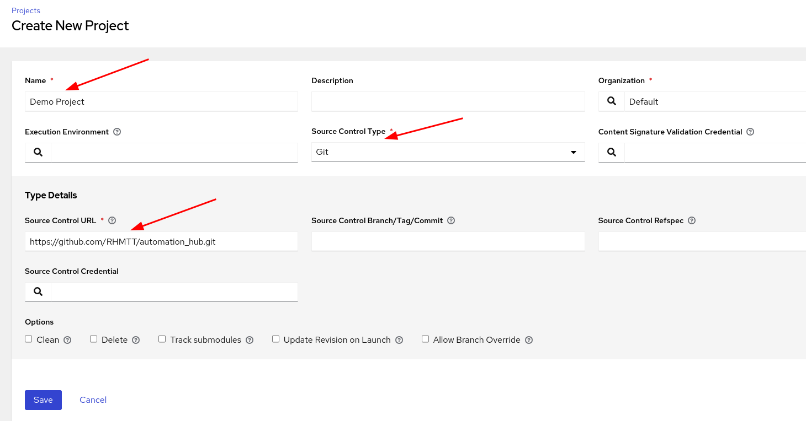
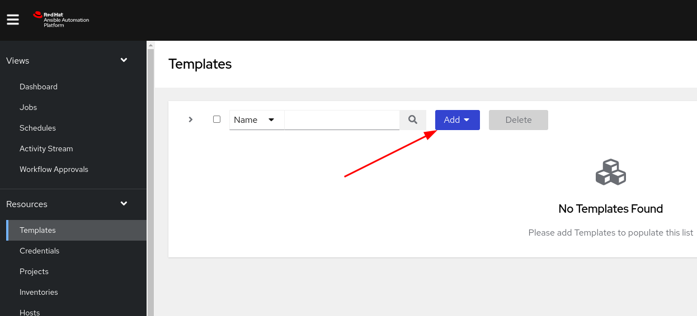

# Exercise 5 - How to use Collections on Red Hat Ansible Controller

## Table of Contents

- [Objective](#objective)
- [Guide](#guide)
    - [Step 1 - Create a Credential for Private Automation Hub](#step-1---write-a-requirementsyml)
    - [Step 2 - Define Collection lookup on Organization](#step-2---create-job-template)
- [Troubleshooting](#troubleshooting)

# Objective

Red Hat Ansible Controller will automatically install and configure collections for you from the project. To make sure Ansible Collections are recognized by Red Hat Ansible Controller a requirements file is needed and has to be stored in the proper directory.

Ansible Galaxy is already configured by default, however if you want your Red Hat Ansible Controller to prefer and fetch content from the Red Hat Automation Hub, additional configuration changes are required.

# Guide

In this exercise you will learn how to define an Ansible Collection as a requirement in a format recognized by Red Hat Ansible Controller and how to configure the Controller to use the Private Automation Hub to pull from.

## Step 1 - Write a requirements.yml

Red Hat Ansible Controller can download and install Ansible Collections automatically before executing a Job Template. If a `collections/requirements.yml` exists, it will be parsed and Ansible Collections specified in this file will be automatically installed.

> **NOTE**: Since the Ansible Collection is downloaded into this directory before the Job Template is executed, you will find temporary files of your Ansible Collection in `/var/lib/awx/projects/`.

The format of the `requirements.yml` for Ansible Collections is very similar to the one for roles, however it is very important to store in the folder `collections`.

Here is what our Ansible Collection requirements looks like that has been pre created for us to use with AAP:

```yaml
---
collections:
- ansible.posix
- workshop.demo_collection
```

## Step 2 - Create a credential for the Private Automation Hub

We need to create a credential that will have the url of the repo and the api token needed to authenticate.

1. Log into your Controller node this can be found on your workshop portal, with a link to the url the username is admin and password is provided on the portal.

   

Once logged in, navigate to Credentials

   

Next Add a new credential

   

Set the credential as follows

   


Name: Private Automation Hub - Published
Organization: Default
Credential Type: Ansible Galaxy/Automation Hub API Token

Details we get from the private automation hub
Galaxy Server URL: is the link from the Published Repo

   

Token: is the API token we got earlier and populated it into your .ansible.cfg if you didnt create one and regenerate it from the UI note you will need to repopulate the ansible.cfg as the user can only have 1 active API token.


## Step 3 - Configure the Organization to pull from the Private Automation Hub
The Credential we created behaves the same as what we used in the CLI, we create one for each repo we would pull from, and therefore we need to set the order in which we call them, in the Controller this is set at the Organization level.

Navigate to Organizations and select Default

   

Select edit

   

Click on the magnifying glass next to Galaxy Credentials.
Put a tick into the Private automation hub credential you created and then you will see it populate at the top, then you want to drag it above Ansible Galaxy so the order in which it looks up is correct.

   

Press Select and Save.

## Step 3 - Create a Project 

Now that we have created a Credential to be able to locate our colletion from Automation hub, we next want to have the controller download the Project and Collection.

Navigate to Projects.

   

Add a new Project

   

Fill in the Project fields as such

name: Demo Project
Source Control Type: Git
Source Control URL: https://github.com/RHMTT/automation_hub.git

   

Click Save

This will initiate it to download it, you will see a sync running

   

It will change to Successful you can click on it whilst it syncs or when it completes to see the output, at the bottom of the sync you will see it shows it pulled the collections for us.

   

Not only do we see the output but the location where the local copy is on the controller server if we wanted to check it.

## Step 4 - Create a Template

The Project also had a basic playbook inside of it also that we can run to see that we can execute this with our custom collection from Automation Hub.

Navigate to Templates

   

Add a new template

   

Fill in the following

Name: Demo Template
Inventory:  Workshop Inventory
Project: Demo Project
Playbook: playbook.yml
Credentials: Workshop Credential

   

Scroll down and click save

All we have left to do now is to launch the template click on launch

   


This will go to the job output window and we can see it execute 

   

This now completes how we can use Collections from Automation Hub with Controller.

If there is a problem while parsing your `requirements.yml` it worth testing it with the `ansible-galaxy` command. As a reminder, Red Hat Ansible Controller basically also just runs the command for you with the appropriate parameters, so testing this works manually makes a lot of sense.


----
**Navigation**
<br>
[Previous Exercise](../4-collections-from-roles/)

[Click here to return to the Ansible for Red Hat Enterprise Linux Workshop](../README.md)
